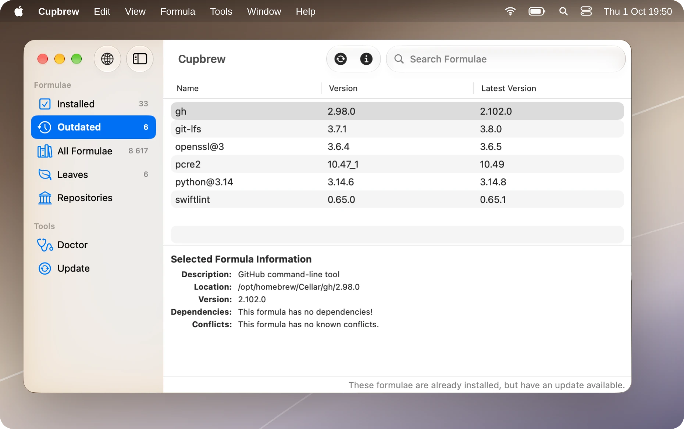

# Cupbrew

A simple Mac app for [Homebrew](https://brew.sh). See what's installed and what's out of
date, look up a formula, and install, upgrade or remove it.

<p align="center">
  
</p>

## Why Cupbrew exists

I used [Cakebrew](https://github.com/brunophilipe/Cakebrew) for years, and Cupbrew is
inspired by it. But Cakebrew hasn't been updated since 2021, so I rebuilt it from scratch
in SwiftUI. If you've used Cakebrew, you'll feel at home: the window, the lists and the
buttons are where it had them. Underneath, Cupbrew reads Homebrew's JSON output rather
than its text, so new versions of Homebrew are much less likely to break it.

## What it does

- **Lists** — Installed, Outdated, All Formulae, Leaves and Repositories (taps), with a
  count next to each, and search across every formula.
- **Details** — select a formula to see its description, version, location, dependencies
  and conflicts. Press Space or ⌘I for `brew info` and what depends on it.
- **Actions** — install (with or without options), uninstall, upgrade one formula, the
  selected ones or everything outdated, tap and untap, and `brew cleanup`. Each action
  asks first, then shows Homebrew's output as it runs.
- **Tools** — Doctor and Update, and Brewfile export and import (`brew bundle`).
- **Long commands** — when one finishes, the Dock icon bounces and you get a
  notification.
- **Errors** — when a list can't load, Cupbrew shows Homebrew's message instead of an
  empty list.
- **Updates** — Cupbrew can check for new versions by itself, or any time with Check for
  Updates… in the Cupbrew menu.

Cupbrew works with formulae — command-line tools and libraries. Apps installed as casks
aren't covered.

## Requirements

macOS 15 or later, and Homebrew.

## Building from source

```sh
xcodebuild -scheme Cupbrew -configuration Release build
```

Or open `Cupbrew.xcodeproj` in Xcode. [SwiftLint](https://github.com/realm/SwiftLint)
runs as a build phase when it's installed. The version comes from the latest git tag and
the build number from the commit count, so build from a git clone.

## Roadmap

- [ ] Visit Website and Help in the menus.
- [ ] Translations. Cupbrew is English only for now.

## Credits

The interface follows Cakebrew by [Bruno Philipe](https://github.com/brunophilipe) and
contributors. No code or artwork is taken from it: Cupbrew is written from scratch.

## License

[MIT](LICENSE).
